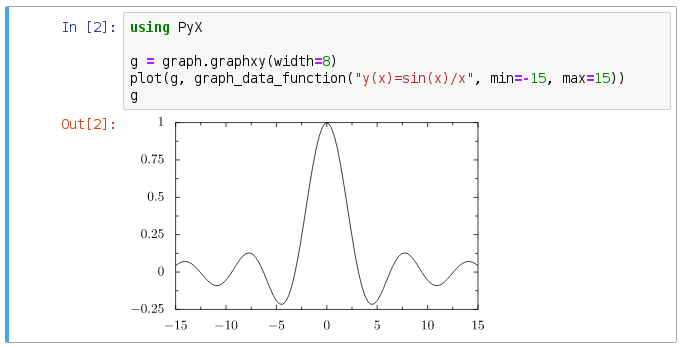

PyX Graphics for Julia
=============================================================================

This is a Julia wrapper of the PyX plotting and TeX graphics library from
Python.

It is a work in progress, broken, and will set your computer on fire. See also
the TODO file.

**Source Code:** https://github.com/bnewbold/PyX.jl

**Travis CI:** https://travis-ci.org/bnewbold/PyX.jl

## Example

```
using PyX

g = graph.graphxy(width=8)
plot(g, graph_data_function("y(x)=sin(x)/x", min=-15, max=15))
writePDFfile(g, "example_graph.pdf")
```

Plotting works automagically from within Jupyter and other graphic interfaces:




There are many (ported) examples in the ./examples/ directory of this
repository. See the Python PyX upstream documentation for example outputs:
<http://pyx.sourceforge.net/>

For pipeGS (ghostscript file conversion) output "device" options, see:
<http://www.ghostscript.com/doc/current/Devices.htm>

## Dependencies and Python Version

You'll obviously need the underlying Python PyX library installed, plus any
dependencies (eg, LaTeX and Ghostscript). These are pretty huge and complex
packages to install! Use something like Debian's `apt` or Homebrew on OS X. No
idea how to get this set up on Windows or other platforms.

*NOTE:* PyX versions starting with 0.13 are Python3-only. PyX versions 0.12.1
and earlier are Python2-only. This split happened back in 2013. This wrapper
will work with versions on either side of the split, but the newer versions
(starting with PyX 0.14) support SVG and newer features. Unfortunately,
switching Julia's PyCall wrapper from Python2 to Python3 is all or nothing.
Careful! If you decide to do this, run:

    julia> ENV["PYTHON"] = "/usr/bin/python3" # Or your local full path
    julia> Pkg.build("PyCall")

## Installation

This package is not (yet) listed in the official Julia MANIFEST.jl index, so
you'll need to install it "unregistered" style:

    julia> Pkg.clone("https://github.com/bnewbold/PyX.jl")
    julia> using PyX

To run tests, do something like:

    JULIA_LOAD_PATH=src julia test/runtests.jl

## Differences from Python

All the expected [Julia/Python differences][1] apply:

 * use Julia's `nothing` instead of Python's `None`
 * use 1-indexing instead of 0-indexing, and require `end` in slice syntax
 * function calls like `writeEPSfile(c, filename)` instead of object method
   calls like `c.writeEPSfile(filename)`.

Note that the string code snippets that go into `graph_data_function` are still
Python code, not Julia.

Because the Python syntax features for objects (they can both be accessed like
a module or called like a function) does not map to any Julia type at this
time, a naming convention is used such that only a single `.` separator is used
in Julia names and calls, and underscore characters (`_`) are used in
objects-as-modules to access attributes. For example:

    python> from pyx import style, color, graph
    python> style.linewidth.THICK
    python> style.linewidth(0.5)
    python> color.rgb.red
    python> graph.axis.split()
    
    julia> using PyX
    julia> style_linewidth.THICK
    julia> style.linewidth(0.5)
    julia> color_rgb.red
    julia> graph_axis.split()

See HACKING for more details.

To avoid namespace collisions or confusion with built-in Julia functions the
following functions (only) have `pyx_` preprended to the function name:

    pyx_fill, pyx_append, pyx_insert, pyx_text

`function` is also a reserved keyword in Julia, so use `graph_data_function`
instead of `graph_data.function`.

[1]: http://docs.julialang.org/en/stable/manual/noteworthy-differences/#noteworthy-differences-from-python)

## License

Following the license of the underlying PyX python library, this wrapper is
licensed under the GNU GPL Version 2 (or later). See the LICENSE file, and the
upstream licensing note: <http://pyx.sourceforge.net/license.html>

